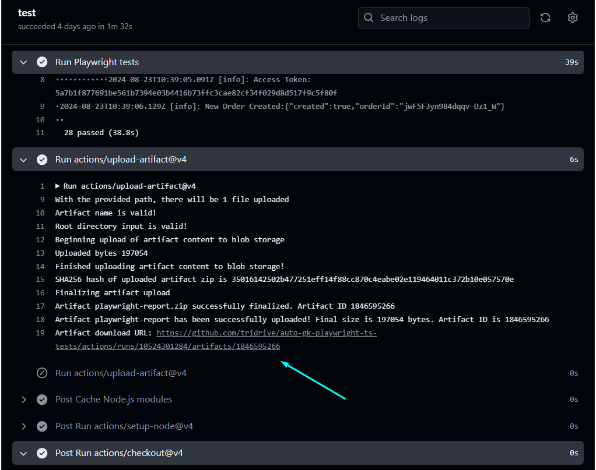

# Playwright TypeScript Automation Project

This project uses Playwright with TypeScript to automate both UI and API testing for the Green Kart web application and the Simple Grocery Store API. It includes health checks, end-to-end scenarios, and comprehensive API coverage.

## Table of Contents

1. Project Overview
2. Test Coverage
   - UI Automation
   - API Automation
3. How to Run Tests
   - Without Debug Logs
   - With Debug Logs
   - Running Specific Spec
4. Viewing Reports

## Project Overview

This project automates testing for:

1. **Green Kart Web Application**: [Green Kart](https://rahulshettyacademy.com/seleniumPractise/#/) is a web-based application that allows users to search, select, and order products. The Playwright test cases cover health checks of the application, along with end-to-end scenarios such as searching for products, selecting them, and placing orders for both single and multiple items.

2. **Simple Grocery Store API**: This API, described in detail [here](https://github.com/vdespa/Postman-Complete-Guide-API-Testing/blob/main/simple-grocery-store-api.md), supports a simple grocery store's functionality. The automation scripts cover various endpoints, including status checks, cart creation, adding products, authorization, and placing orders.

## Test Coverage

### UI Automation

For the Green Kart web application, the following scenarios are automated:

- **Health Check**: Basic health check to ensure the application is up and running.
- **Search and Select Product**: Search for a specific product and select it.
- **Place Order for One Product**: Add a single product to the cart and proceed to checkout.
- **Place Order for Multiple Products**: Add multiple products to the cart and proceed to checkout.

### API Automation

For the Simple Grocery Store API, the following test scenarios are automated:

- **Status Check**: Check the status of the API to ensure it is operational.
- **Create Cart**: Create a new shopping cart.
- **Add Product**: Add a product to the cart using its ID.
- **Authorize**: Perform authorization to ensure secure operations.
- **Place Order**: Place an order with the items added to the cart.

## Winston Library Logging and Debugging

This project utilizes the Winston library for logging purposes. Both `debug` and `info` level logs are supported, allowing you to capture different levels of detail based on your needs.

## How to Run Tests


#### To run the tests without debug logs:

```powershell
$env:LOG_LEVEL = "info"; npx playwright test
```
#### To run the tests with debug logs:
```powershell
$env:LOG_LEVEL = "debug"; npx playwright test
```
#### To run a specific spec:
```bash
$env:LOG_LEVEL = "debug"; npx playwright test  tests/green_kart_application_UI/gk_orderMultipleProducts.spec.ts --project=chromium --headed
```
```bash
$env:LOG_LEVEL = "debug"; npx playwright test tests/grocery-store-api/gs_e2eFlow-api.spec.ts --project=chromium 
```
## Viewing Test Reports
After the GitHub Actions workflow runs, test reports are uploaded as an artifact named playwright-report. You can view and download the reports by navigating to the workflow run details and accessing the playwright-report artifact.

sample:


# Code styling and linting assistant
Implemented ESLint and Prettier to ensure code quality and consistency.

### ESLint
To see all the linting issues, run:
``` bash
npx eslint tests 
```
Additionally, installing the Error Lens extension in your code editor will highlight errors directly in the file before even running the command.

To fix the fixables we can use 
``` bash
npx eslint tests --fix
```

### Prettier
To format a specific file, use:
``` bash 
npx prettier tests/interview/medium.spec.ts --write
```
To format all files in the tests directory, use:
``` bash 
npx prettier tests --write
```

# to start or include 
> Zero_step