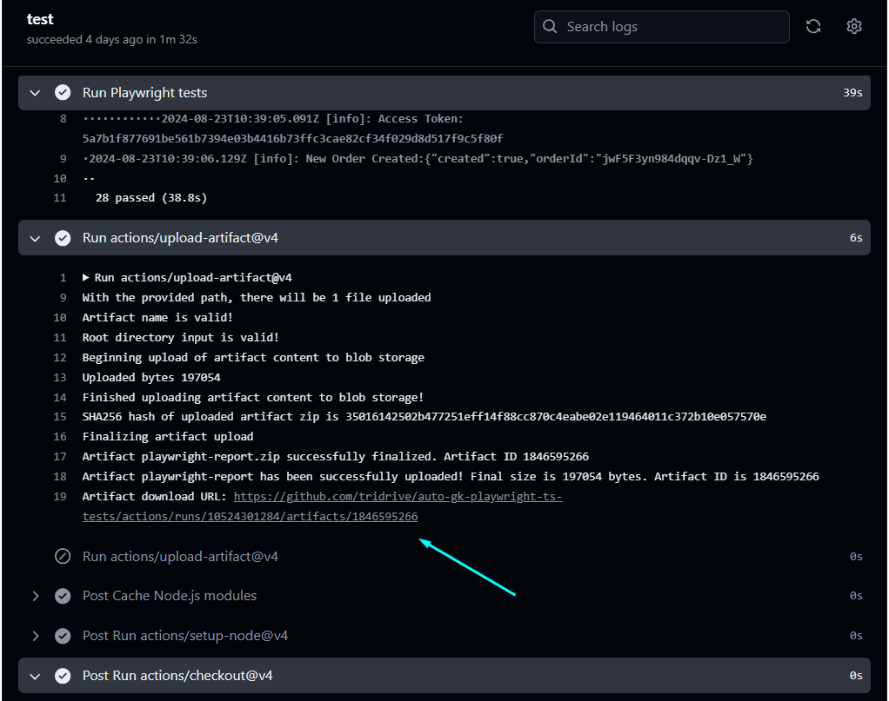

# Playwright TypeScript Automation Project [](https://github.com/Sunil-Kumar-Reddy-K/Playwright-ts_UI_and_API_Automation_framework/actions/workflows/playwright.yml)

This project uses **Playwright** with **TypeScript** to automate both UI and API testing for the **Green Kart** web application and the **Simple Grocery Store API**. It includes health checks, end-to-end scenarios, and comprehensive API coverage.

## Table of Contents

1. [Project Overview](#project-overview)
2. [Test Coverage](#test-coverage)
    - [UI Automation](#ui-automation)
    - [API Automation](#api-automation)
3. [How to Run Tests](#how-to-run-tests)
    - [Without Debug Logs](#without-debug-logs)
    - [With Debug Logs](#with-debug-logs)
    - [Running Specific Spec](#running-specific-spec)
4. [Viewing Reports](#viewing-reports)
5. [Code Styling and Linting](#code-styling-and-linting)
    - [ESLint](#eslint)
    - [Prettier](#prettier)
6. [Acknowledgments](#acknowledgments)
7. [Latest Implementations](#latest-implementations)
8. [Slack Notification Integration](#slack-notification-integration)
9. [Tesseract.js Integration](#tesseractjs-integration)
    - [Installation](#installation)
10. [How to Uninstall the Packages](#how-to-uninstall-the-packages)
    - [Verify Uninstall](#verify-uninstall)
    - [Clean Up](#clean-up)
11. [The Power of --help in NPX Command](#the-power-of--help-in-npx-command)
12. [Commands I Normally Use](#commands-i-normally-use)

## Project Overview

This project automates testing for:

### Green Kart Web Application

**Green Kart** is a web-based application that allows users to search, select, and order products. The Playwright test cases cover health checks of the application, along with end-to-end scenarios such as searching for products, selecting them, and placing orders for both single and multiple items.

### Simple Grocery Store API

This API, described in detail [here](https://github.com/vdespa/Postman-Complete-Guide-API-Testing/blob/main/simple-grocery-store-api.md), supports a simple grocery store's functionality. The automation scripts cover various endpoints, including status checks, cart creation, adding products, authorization, and placing orders.

## Framework Approaches

This framework supports three distinct approaches to running tests:

1. **Regular Playwright Tests**: This is the traditional method where tests are executed using the Playwright test framework along with the Page Object Model (POM).

2. **Playwright Zero-Step AI**: This approach incorporates AI-driven tests. More details regarding the implementation and usage can be found in the `documents` folder of the repository.

3. **BDD Approach**: To implement Behavior Driven Development (BDD), we have followed the guidance provided in the [Playwright BDD documentation](https://vitalets.github.io/playwright-bdd/#/getting-started/index) and the [playwright-bdd-example GitHub repository](https://github.com/vitalets/playwright-bdd-example).

## Winston Library Logging and Debugging

This project utilizes the Winston library for logging purposes. Both `debug` and `info` level logs are supported, allowing you to capture different levels of detail based on your needs.

## Test Coverage

### UI Automation 👨‍💻

For the Green Kart web application, the following scenarios are automated:

-   **Health Check**: Basic health check to ensure the application is up and running.
-   **Search and Select Product**: Search for a specific product and select it.
-   **Place Order for One Product**: Add a single product to the cart and proceed to checkout.
-   **Place Order for Multiple Products**: Add multiple products to the cart and proceed to checkout.

### API Automation 🧑‍🍳

For the Simple Grocery Store API, the following test scenarios are automated:

-   **Status Check**: Check the status of the API to ensure it is operational.
-   **Create Cart**: Create a new shopping cart.
-   **Add Product**: Add a product to the cart using its ID.
-   **Authorize**: Perform authorization to ensure secure operations.
-   **Place Order**: Place an order with the items added to the cart.

## How to Run Tests

> ### Without Debug Logs

```powershell
$env:LOG_LEVEL = "info"; npx playwright test
```

> ### With Debug Logs

```powershell
$env:LOG_LEVEL = "debug"; npx playwright test
```

> ### Running Specific Spec

```powershell
$env:LOG_LEVEL = "debug"; npx playwright test tests/green_kart_application_UI/gk_orderMultipleProducts.spec.ts --project=chromium --headed
```

## Zero-Step Integration 🤖

Implemented ZeroStep in this repository to enhance Playwright testing capabilities with AI functionalities. ZeroStep allows supercharge tests by utilizing AI-driven commands that can interact with web pages intelligently.

For more information on how to set up ZeroStep in project, please refer to official GitHub repository: [ZeroStep GitHub Repository](https://github.com/zerostep-ai/zerostep)

## How to Run the BDD tests

```powershell
npx bddgen --tags "@BDD"; npx playwright test --project=bdd_chromium --workers=1 --headed
```

## Viewing Test Reports 📂

After the GitHub Actions workflow runs, test reports are uploaded as an artifact named playwright-report. You can view and download the reports by navigating to the workflow run details and accessing the playwright-report artifact.

sample:


# Code styling and linting assistant

Implemented ESLint and Prettier to ensure code quality and consistency.

### ESLint 🧵

To see all the linting issues, run:

```powershell
npx eslint tests
```

Additionally, installing the Error Lens extension in your code editor will highlight errors directly in the file before even running the command.

To fix the fixables we can use

```powershell
npx eslint tests --fix
```

### Prettier 🦋

To format a specific file, use:

```powershell
npx prettier tests/interview/medium.spec.ts --write
```

To format all files in the tests directory, use:

```powershell
npx prettier tests --write
```

### Playwright

#### Debugging Test Discovery

To debug why the tests are not being discovered::

```powershell
npx playwright test --list
```

## Slack Notification Integration 📫

Slack messages have been integrated into the GitHub Actions pipeline to notify the team of test results for both UI and API tests. The Slack messages are configured to be sent to a designated channel once tests are completed, and they provide a link to the HTML reports stored in the playwright-report folder.

-   source of learning
    -   from collab repo
    -   Some YouTube videos

## Tesseract.js Integration 🏜️

In this project, I have integrated Tesseract.js to extract text from images using Playwright. Below are the details of the implementation process.

-   source of learning
    _ letCode koushik
    _ Some other YouTube videos
    > ### Installation

To use Tesseract.js, ensure it is installed in your project. You can add it by running the following command:

```powershell
npm i tesseract.js
```

## The Power of --help in NPX Command 💁

The --help option in the npx command can provide valuable information about the available commands and their usage. For example, running npx --help will display a list of all the available npx commands and their descriptions.

# Repo Maintenance 🛠️

> ### How to Uninstall the packages
>
> To uninstall the package ex: `@nut-tree-fork/nut-js`, you can use the following command in your terminal or command prompt:

```powershell
npm uninstall @nut-tree-fork/nut-js
```

> ### Verify Uninstall

Verify Uninstallation: After running the command, you can check your package.json file or run the following command to ensure that the package has been removed:

```powershell
npm list @nut-tree-fork/nut-js
```

If the package is uninstalled successfully, you should see a message indicating that the package is not found.

> ### Clean Up
>
> If you want to remove any unused dependencies, you can run:

```powershell
npm prune
```

## Acknowledgments / Implementations 🔬:

-   This implementation of TypeScript code styling and linting was inspired by Thananjayan's article on Medium .

    > https://medium.com/@thananjayan1988/typescript-code-styling-and-linting-assistant-93ff67557b1c

-   Use the Playwright Reporter API to Create Custom Reports\*\*
    In addition to the following medium documentation i took help of GPT to print the report in an txt file and we can find the same inside the playwright-report > custom-report
    > https://medium.com/@eugenegronski/how-to-use-the-playwright-reporter-api-to-create-custom-reports-43de0e89cd3f

## Commands I Normally Use ⌨️

```powershell
$env:LOG_LEVEL = "debug"; npx playwright test tests/playwright_utube/dynamicContent_APImocking.spec.ts --project=chromium --headed --ui

$env:LOG_LEVEL = "debug"; npx eslint tests/grocery-store-api/gs_e2eFlow-api.spec.ts

$env:LOG_LEVEL = "debug"; npx playwright test tests/medium/mastering-fixtures-inside.spec.ts --project=chromium --headed --workers=1

$env:LOG_LEVEL = "debug"; npx playwright test tests/checkly_utube/timer_control.spec.ts --project=chromium --headed --debug

$env:LOG_LEVEL = "debug"; npx playwright test tests/automation_using_tessaract_js/rs_logoRead.spec.ts --project=chromium --headed

$env:ENV="local"; npx bddgen --tags "@crypto"; npx playwright test --project=bdd_chromium --workers=1 --headed

$env:LOG_LEVEL = "debug"; $env:ZEROSTEP_TOKEN = "0step:2bee65c6-9cc5-4e29-8eaa-03daf7e173c3"; npx playwright test tests/zero_step/gk_happyPath.spec.ts --project=chromium --headed

$env:LOG_LEVEL = "debug"; npx playwright test --grep "HRM" --project=chromium --headed
```

# Decorators

> -   we can only use decorators inside a class so that makes us to only use in POM pages
>     https://www.youtube.com/watch?v=of1v9cycTdQ

# Yet to Implemet in the repo ✒️

> Zero_step , bdd, just started , yet to install bdd deps and add the same to readme , change the location of fixtures eetc

> azure pipeline

> ortoni report

> .env implementation , [text](https://www.npmjs.com/package/dotenv) "https://www.youtube.com/watch?v=OpxLilD600I&ab_channel=CommitQuality"

> just run one file like unit test ex crypti is "ts-node lib\cryptoUtils.ts"

> ctrf- report, [text](https://ctrf.io/docs/intro) > checked for playwright and git hub
